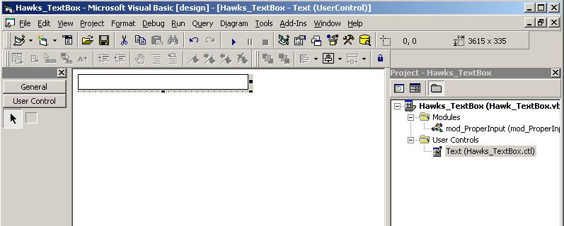

<div align="center">

## Adv TextBox


</div>

### Description

This is new Text Box. You can Select Propertics and Select Char, Decimal , Email Type of Data Esally. You add a ActiveX control; In a New Project Window . Add text Box on your Form . and Copy this code and Paste Code View. and in the end u create OCX from File Menu. after creating OCX u can Use Very esally.
 
### More Info
 


<span>             |<span>
---                |---
**Submitted On**   |
**By**             |[Shoaib Mahmood](https://github.com/Planet-Source-Code/PSCIndex/blob/master/ByAuthor/shoaib-mahmood.md)
**Level**          |Beginner
**User Rating**    |3.8 (15 globes from 4 users)
**Compatibility**  |VB 6\.0
**Category**       |[VB function enhancement](https://github.com/Planet-Source-Code/PSCIndex/blob/master/ByCategory/vb-function-enhancement__1-25.md)
**World**          |[Visual Basic](https://github.com/Planet-Source-Code/PSCIndex/blob/master/ByWorld/visual-basic.md)
**Archive File**   |[](https://github.com/Planet-Source-Code/shoaib-mahmood-adv-textbox__1-64864/archive/master.zip)


### Source Code

```
Enum DTypes
  MyChar = 0
  MyInt = 1
  MyMix = 2
  MyDecimal = 3
  MyPhone = 4
  MyEmail = 5
  MyNone = 6
  MyIntChar = 7
End Enum
'Default Property Values:
Const m_def_DataType = 0
Event Change() 'MappingInfo=Text1,Text1,-1,Change
'Property Variables:
Dim m_DataType As Integer
Private Sub Text1_GotFocus()
  Text1.SelStart = 0: Text1.SelLength = Len(Text1)
  'Command1.Visible = True
End Sub
Private Sub Text1_KeyPress(KeyAscii As Integer)
  If m_DataType = 0 Then
    If Not IsChar(KeyAscii) Then KeyAscii = 0
  ElseIf m_DataType = 1 Then
    If Not IsInt(KeyAscii) Then KeyAscii = 0
  ElseIf m_DataType = 2 Then
    If Not IsMix(KeyAscii) Then KeyAscii = 0
  ElseIf m_DataType = 3 Then
    If IsDecimal(KeyAscii) Then
      If Not IsProperDecimal(Text1 + Chr(KeyAscii)) Then
        KeyAscii = 0
      End If
    Else
      KeyAscii = 0
    End If
  ElseIf m_DataType = 4 Then
    If Not IsPhone(KeyAscii) Then KeyAscii = 0
  ElseIf m_DataType = 5 Then
    If Not IsEmail(KeyAscii) Then KeyAscii = 0
  ElseIf m_DataType = 6 Then
    'Do Nothing
  ElseIf m_DataType = 7 Then
    If Not IsIntChar(KeyAscii) Then KeyAscii = 0
  End If
End Sub
'Private Sub Text1_LostFocus()
'  Command1.Visible = False
'End Sub
'Private Sub UserControl_KeyPress(KeyAscii As Integer)
'  If KeyAscii = 13 Then
'    SendKeys vbTab
'  End If
'End Sub
Private Sub UserControl_Resize()
  Text1.Width = UserControl.Width
  UserControl.Height = Text1.Height
  Command1.Top = Text1.Top + 10
  Command1.Left = Text1.Width - 390
End Sub
'WARNING! DO NOT REMOVE OR MODIFY THE FOLLOWING COMMENTED LINES!
'MappingInfo=UserControl,UserControl,-1,Enabled
Public Property Get Enabled() As Boolean
  Enabled = UserControl.Enabled
End Property
Public Property Let Enabled(ByVal New_Enabled As Boolean)
  UserControl.Enabled() = New_Enabled
  PropertyChanged "Enabled"
End Property
'Initialize Properties for User Control
Private Sub UserControl_InitProperties()
  m_DataType = m_def_DataType
End Sub
'Load property values from storage
Private Sub UserControl_ReadProperties(PropBag As PropertyBag)
  UserControl.Enabled = PropBag.ReadProperty("Enabled", True)
  Text1.MaxLength = PropBag.ReadProperty("MaxLength", 0)
  Text1.Text = PropBag.ReadProperty("Text", "")
  m_DataType = PropBag.ReadProperty("DataType", m_def_DataType)
  Text1.PasswordChar = PropBag.ReadProperty("PasswordChar", "")
  Text1.BackColor = PropBag.ReadProperty("BackColor", &H80000005)
'  Text1.Alignment = PropBag.ReadProperty("Alignment", 0)
End Sub
'Write property values to storage
Private Sub UserControl_WriteProperties(PropBag As PropertyBag)
  Call PropBag.WriteProperty("Enabled", UserControl.Enabled, True)
  Call PropBag.WriteProperty("MaxLength", Text1.MaxLength, 0)
  Call PropBag.WriteProperty("Text", Text1.Text, "")
  Call PropBag.WriteProperty("DataType", m_DataType, m_def_DataType)
  Call PropBag.WriteProperty("PasswordChar", Text1.PasswordChar, "")
  Call PropBag.WriteProperty("BackColor", Text1.BackColor, &H80000005)
'  Call PropBag.WriteProperty("Alignment", Text1.Alignment, 0)
End Sub
'WARNING! DO NOT REMOVE OR MODIFY THE FOLLOWING COMMENTED LINES!
'MappingInfo=Text1,Text1,-1,MaxLength
Public Property Get MaxLength() As Long
  MaxLength = Text1.MaxLength
End Property
Public Property Let MaxLength(ByVal New_MaxLength As Long)
  Text1.MaxLength() = New_MaxLength
  PropertyChanged "MaxLength"
End Property
'WARNING! DO NOT REMOVE OR MODIFY THE FOLLOWING COMMENTED LINES!
'MappingInfo=Text1,Text1,-1,Text
Public Property Get Text() As String
  Text = Text1.Text
End Property
Public Property Let Text(ByVal New_Text As String)
  Text1.Text() = New_Text
  PropertyChanged "Text"
End Property
''WARNING! DO NOT REMOVE OR MODIFY THE FOLLOWING COMMENTED LINES!
''MemberInfo=7,3,0,0
Public Property Get DataType() As DTypes
  DataType = m_DataType
End Property
Public Property Let DataType(ByVal New_DataType As DTypes)
  m_DataType = New_DataType
  PropertyChanged "DataType"
End Property
'WARNING! DO NOT REMOVE OR MODIFY THE FOLLOWING COMMENTED LINES!
'MappingInfo=Text1,Text1,-1,PasswordChar
Public Property Get PasswordChar() As String
  PasswordChar = Text1.PasswordChar
End Property
Public Property Let PasswordChar(ByVal New_PasswordChar As String)
  Text1.PasswordChar() = New_PasswordChar
  PropertyChanged "PasswordChar"
End Property
Private Sub Text1_Change()
  RaiseEvent Change
End Sub
'WARNING! DO NOT REMOVE OR MODIFY THE FOLLOWING COMMENTED LINES!
'MappingInfo=Text1,Text1,-1,BackColor
Public Property Get BackColor() As OLE_COLOR
  BackColor = Text1.BackColor
End Property
Public Property Let BackColor(ByVal New_BackColor As OLE_COLOR)
  Text1.BackColor() = New_BackColor
  PropertyChanged "BackColor"
End Property
Function IsIntChar(a As Integer) As Boolean
  If (a < 97 Or a > 122) And (a < 65 Or a > 90) And (a <> 8) And (a < 48 Or a > 57) Then
    IsIntChar = False
  Else
    IsIntChar = True
  End If
End Function
Function IsChar(a As Integer) As Boolean
  If (a < 97 Or a > 122) And (a < 65 Or a > 90) And (a <> 8) And (a <> 32) Then
    IsChar = False
  Else
    IsChar = True
  End If
End Function
Function IsInt(a As Integer) As Boolean
  If (a < 48 Or a > 57) And (a <> 8) Then
    IsInt = False
  Else
    IsInt = True
  End If
End Function
Function IsMix(a As Integer) As Boolean
  If (a < 97 Or a > 122) And (a < 65 Or a > 90) And (a < 48 Or a > 57) And (a <> 8) And (a <> 32) And (a <> Asc("-")) And (a <> Asc(".")) Then
    IsMix = False
  Else
    IsMix = True
  End If
End Function
Function IsPhone(a As Integer) As Boolean
  If (a < 48 Or a > 57) And (a <> 8) And (a <> Asc("-")) Then
    IsPhone = False
  Else
    IsPhone = True
  End If
End Function
Function IsEmail(a As Integer) As Boolean
  If (a < 97 Or a > 122) And (a < 65 Or a > 90) And (a <> 8) And (a < 48 Or a > 57) And a <> Asc("-") And a <> Asc("@") And a <> Asc(".") Then
    IsEmail = False
  Else
    IsEmail = True
  End If
End Function
Function IsProperDecimal(No As String) As Boolean
  Dim NoLen
  Dim DotFlag
  DotFlag = 0
  NoLen = Len(No)
  For i = 1 To NoLen
    If Mid(No, i, 1) = "." Then DotFlag = DotFlag + 1
  Next i
  If DotFlag > 1 Then IsProperDecimal = False Else IsProperDecimal = True
End Function
Function IsDecimal(KeyAscii As Integer) As Boolean
  If (KeyAscii >= 48 And KeyAscii <= 57) Or KeyAscii = 8 Or KeyAscii = Asc(".") Then
    IsDecimal = True
  Else
    IsDecimal = False
  End If
End Function
```

